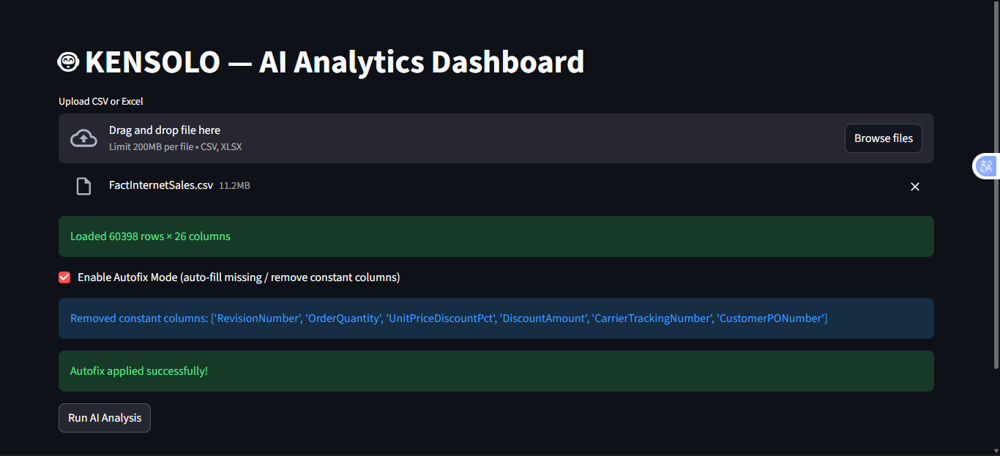

# KENSOLO-AI


Streamlit-based AI analytics dashboard that automatically detects dataset issues, selects prediction targets, provides NLP summaries, generates predictions and recommendations, visualizes graphs, and offers downloadable JSON and PDF reports.

---

## Features
- 🔍 **Dataset Issue Detection** – Automatically find potential issues in your dataset  
- 🎯 **Auto Target Selection** – Identify the best prediction targets  
- 📝 **NLP Summaries** – Generate clear textual summaries of your data  
- 📊 **Visualizations** – Interactive graphs for quick insights  
- 🤖 **Predictions & Recommendations** – AI-powered decision support  
- 💾 **Downloadable Reports** – Export results as JSON or PDF  

---

## Demo

Here’s a preview of the **KENSOLO AI Dashboard**:


.png)
.png)
.png)
.png)
.png)
.png)
.png)
.png)
.png)
.png)
.png)

---

## Quick Start

### Run Locally
1. Clone the repository:
```bash
git clone https://github.com/Suleiman-2001/KENSOLO-AI.git
cd KENSOLO-AI
